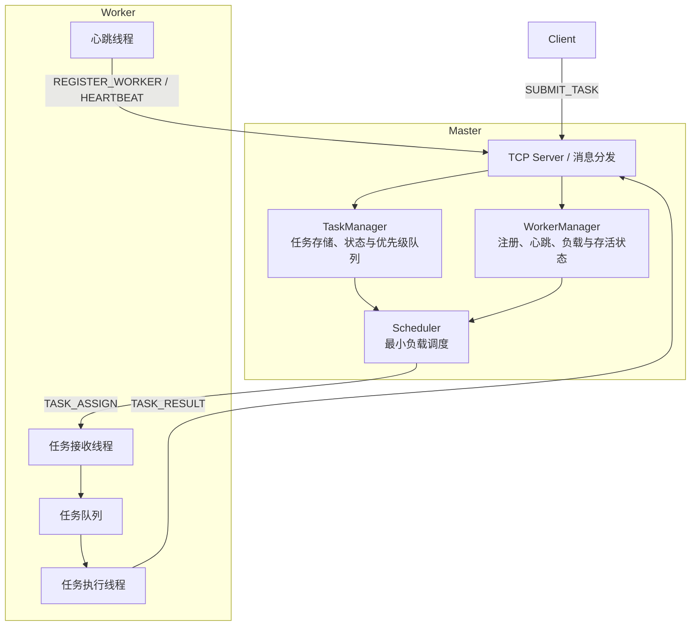
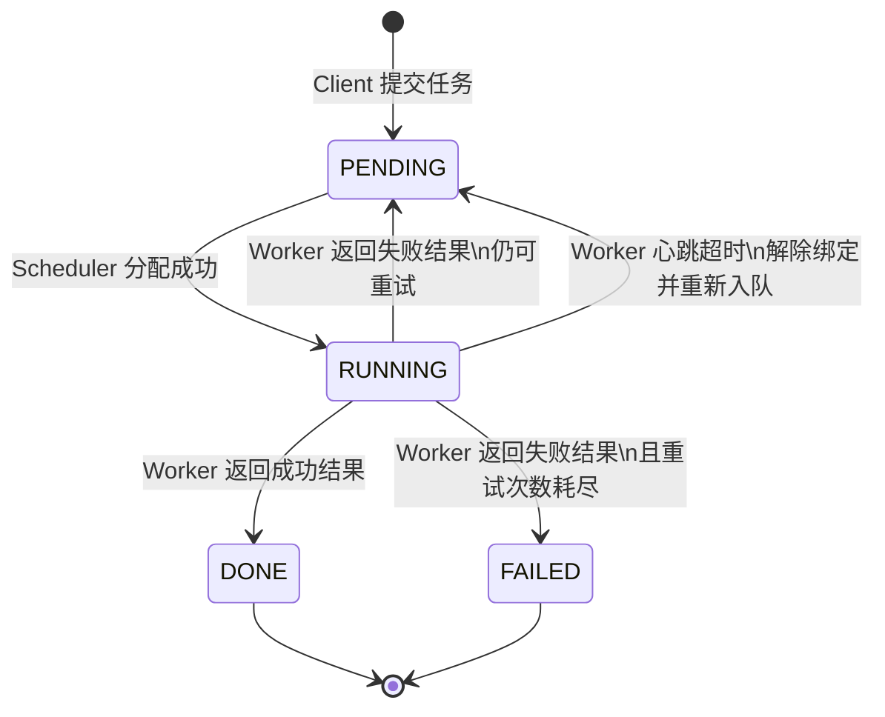

# Distributed Task Scheduler (DTS)

一个基于 C++17 的单机多进程分布式任务调度系统。系统采用 Master–Worker 架构：Client 提交任务，Master 负责保存任务、选择 Worker 并处理故障，Worker 接收并执行任务后回传结果。

当前项目聚焦于一个可验证的 MVP 闭环，并实现了 TCP 消息分帧、优先级调度、Worker 心跳与超时检测、任务失败重试、Worker 超时后的任务恢复，以及后台线程的优雅停止。

## 技术栈

- C++17
- Linux / POSIX Socket
- TCP 网络编程
- 多线程、`std::mutex`、`std::condition_variable`、`std::atomic`
- CMake、CTest、Git

## 系统架构



## 核心流程

1. Client 通过 TCP 向 Master 发送 `SUBMIT_TASK`。
2. Master 创建 Task 并加入 TaskManager 的优先级队列。
3. Scheduler 从待调度任务中取出最高优先级任务，并从存活 Worker 中选择总负载最小的节点；负载相同时选择 Worker ID 更小的节点。
4. Master 发送 `TASK_ASSIGN`，发送成功后任务进入 `RUNNING` 状态并记录被分配的 Worker。
5. Worker 将任务放入本地队列，由执行线程处理后回传 `TASK_RESULT`。
6. Master 根据结果更新任务状态；执行失败时按最大重试次数重新入队，Worker 超时时恢复其仍在运行的任务并重新调度。

## 任务状态



## 已实现能力

- **自定义 TCP 协议与消息分帧**：采用 `length|type|data` 协议。接收端先读取可变长度头部，再通过 `recvExact()` 精确读取 data，正确处理 TCP 拆包、粘包和大消息。
- **任务管理与优先级调度**：TaskManager 使用 `unordered_map` 保存任务，并使用 `priority_queue` 按优先级取出待调度任务。
- **最小负载 Worker 选择**：WorkerManager 维护 Worker 的运行任务数、等待任务数、最后心跳时间和存活状态；调度时只选择存活 Worker。
- **任务失败重试**：Worker 明确返回 `FAILED` 时，Master 按 `MAX_TASK_RETRY = 3` 重新调度；重试次数耗尽后任务进入最终 `FAILED` 状态。
- **心跳与故障恢复**：Worker 每 3 秒上报心跳；Master 超过 10 秒未收到心跳时标记 Worker 死亡，并将其 `RUNNING` 任务重新入队，交由其他存活 Worker 执行。
- **Worker 并发模型**：Worker 使用心跳线程、任务接收线程和任务执行线程；任务队列通过互斥锁与条件变量实现生产者—消费者协作。
- **优雅停止**：Master 与 Worker 的心跳线程使用 `condition_variable::wait_for` 等待，在 `stop()` 中通过通知立即唤醒并退出，不必等待完整心跳周期。

## 构建与测试

环境要求：Linux 或 WSL、支持 C++17 的编译器、CMake 3.15+。

```bash
git clone https://github.com/youi040804/Distributed-Task-Scheduler.git
cd Distributed-Task-Scheduler

mkdir -p build
cd build
cmake ..
cmake --build .
ctest --output-on-failure
```

当前已接入 12 项 CTest 自动化测试：

| 测试类别 | 覆盖内容 |
| --- | --- |
| 协议与网络 | 协议序列化/反序列化、TCP 拆包、粘包、大消息接收 |
| 核心单元测试 | TaskManager 优先级与状态机、WorkerManager 负载与存活状态、调度发送失败回退 |
| 正常与异常闭环 | 注册、正常任务完成、任务失败重试、无可用 Worker 时保留任务 |
| 可靠性 | 心跳刷新与超时检测、优雅停止、Worker 超时后的任务恢复与重新执行 |

详细测试用例见 [test-plan.md](./test-plan.md)。

## 项目结构

```text
include/
├── client/       # Client 接口
├── common/       # Message、Protocol、Task、WorkerInfo
├── master/       # Master、TaskManager、WorkerManager、Scheduler
├── network/      # TCPServer、TCPClient、Connection
└── worker/       # Worker、TaskExecutor

src/              # 对应模块实现
tests/            # protocol、network、master、integration 测试
apps/             # Master / Worker / Client 入口（后续完善）
```

## 当前限制与后续方向

本项目目前定位为单机多进程、内存态的 Master–Worker 调度 MVP。任务和 Worker 元数据不做持久化，Master 重启后无法恢复；任务超时恢复属于至少一次执行语义，若任务具有外部副作用，后续需要引入幂等机制。

后续可以继续完善：任务持久化与 Master 重启恢复、Worker 重新注册后的会话管理、任务取消与查询接口、执行线程池、基于 `epoll` 的高并发连接模型，以及更完整的日志与监控能力。
