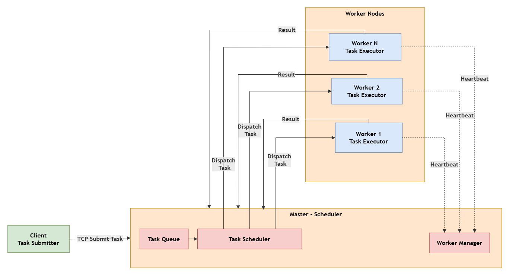

# Distributed Task Scheduler

## Architecture

## Features

- Master-Worker architecture
- TCP communication
- Task scheduling
- Worker heartbeat
- Failure recovery
- Thread pool
- epoll

## Project Structure

...

## Future Improvements

...