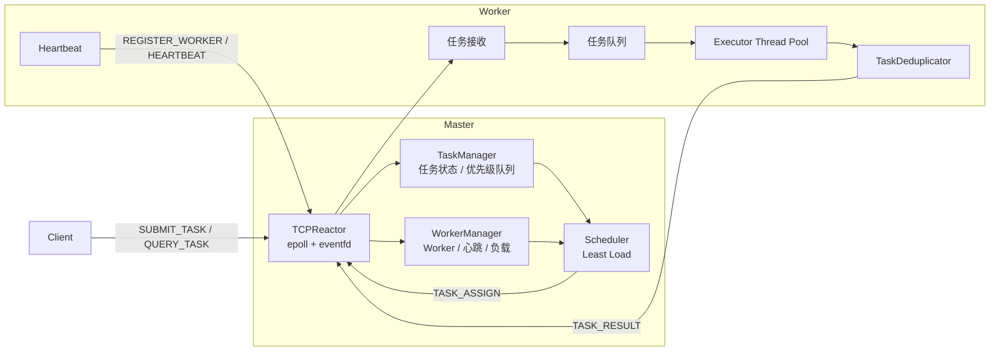

# Distributed Task Scheduler (DTS)

一个基于 C++17 / Linux 实现的分布式任务调度系统。

系统采用 Client–Master–Worker 架构：

- Client 负责提交任务和查询任务状态；
- Master 负责任务状态管理、Worker 管理、任务调度、故障检测与网络事件处理；
- Worker 负责接收任务，并通过可配置线程池执行任务；
- Master 与 Worker 之间通过心跳维护节点存活状态和负载信息。

项目目前实现了基于 epoll 的 Reactor 网络模型、TCP 增量解帧、Worker 可配置线程池、Least Load 调度、任务失败重试、Worker 超时恢复、`execution_id` 执行代次识别，以及 Worker 进程内的任务去重。

---

## 1. 技术栈

- C++17
- Linux / POSIX Socket
- TCP/IP
- epoll / eventfd
- non-blocking I/O
- 多线程
- `std::mutex`
- `std::condition_variable`
- `std::atomic`
- CMake / CTest
- Git

---

## 2. 系统架构


```mermaid
flowchart LR
    Client["Client"]

    subgraph Master["Master"]
        Reactor["TCPReactor<br/>epoll + eventfd"]
        TaskManager["TaskManager<br/>任务状态 / 优先级队列"]
        WorkerManager["WorkerManager<br/>Worker / 心跳 / 负载"]
        Scheduler["Scheduler<br/>Least Load"]
    end

    subgraph Worker["Worker"]
        Receiver["任务接收"]
        Queue["任务队列"]
        Pool["Executor Thread Pool"]
        Dedup["TaskDeduplicator"]
        Heartbeat["Heartbeat"]
    end

    Client -->|"SUBMIT_TASK / QUERY_TASK"| Reactor

    Reactor --> TaskManager
    Reactor --> WorkerManager

    TaskManager --> Scheduler
    WorkerManager --> Scheduler

    Scheduler -->|"TASK_ASSIGN"| Reactor
    Reactor --> Receiver

    Receiver --> Queue
    Queue --> Pool
    Pool --> Dedup

    Dedup -->|"TASK_RESULT"| Reactor
    Heartbeat -->|"REGISTER_WORKER / HEARTBEAT"| Reactor
```

Master 的网络 I/O 由单 Reactor 线程处理。

Scheduler、心跳检测等逻辑与 Reactor 分离。Scheduler 向 Worker 发送任务时，通过 WorkerManager 中注入的发送回调将消息交给 TCPReactor；非 Reactor 线程通过 `eventfd` 唤醒 Reactor，由 Reactor 完成后续 socket 写操作。

---

## 3. TCP 协议与增量解帧

消息采用：

```text
length|type|data
```

格式。

其中：

- `length`：data 长度；
- `type`：消息类型；
- `data`：序列化后的业务数据。

主要消息包括：

```text
SUBMIT_TASK
TASK_SUBMIT_ACK
QUERY_TASK
TASK_STATUS

REGISTER_WORKER
HEARTBEAT

TASK_ASSIGN
TASK_RESULT
```

### FrameDecoder

Master 的 socket 使用 non-blocking 模式，因此一次 `recv()` 不保证获得一条完整消息。

`FrameDecoder` 在 Connection 内部保存尚未完成解析的字节：

```text
recv()
   │
   ▼
FrameDecoder::feed()
   │
   ├── 不完整 frame → 保留在 buffer
   │
   ├── 完整 frame   → 解析 Message
   │
   └── 多个 frame   → 连续解析
```

它处理：

- TCP 拆包；
- TCP 粘包；
- 一次读取多个完整 frame；
- 完整 frame + 下一条 partial frame；
- 非法长度字段；
- 超过最大消息长度的 frame。

当前单条消息最大长度限制为 1 MB。

---

## 4. Master Reactor 网络模型

Master 的连接处理采用 Linux epoll。

主要组件：

```text
TCPServer
   │
   ▼
TCPReactor
   │
   ├── EpollPoller
   ├── Connection
   ├── FrameDecoder
   └── eventfd
```

### 4.1 Non-blocking socket

监听 socket 和 Master 接收的连接均设置为 non-blocking。

`Connection::receiveAvailable()` 持续读取当前 socket 中已经到达的数据：

```text
recv > 0
   ↓
FrameDecoder
   ↓
继续 recv

recv == -1 && EAGAIN
   ↓
当前数据读取完成
   ↓
返回 Reactor
```

`EAGAIN / EWOULDBLOCK` 表示当前没有更多可读数据，不作为连接错误处理。

---

### 4.2 epoll 事件循环

TCPReactor 主要处理：

```text
EPOLLIN
EPOLLOUT
EPOLLRDHUP
EPOLLERR
EPOLLHUP
```

基本流程：

```text
epoll_wait()
    │
    ├── listen fd
    │      └── acceptAvailable()
    │
    ├── EPOLLIN
    │      └── receiveAvailable()
    │
    ├── EPOLLOUT
    │      └── flushOutput()
    │
    └── peer close / error
           └── connection lifecycle
```

Reactor 使用 LT（Level Triggered）模式。

---

### 4.3 Output Buffer

非阻塞 `send()` 可能无法一次写完全部数据。

Connection 因此维护：

```text
output_buffer_
output_offset_
```

发送流程：

```text
queueMessage()
      │
      ▼
output buffer
      │
      ▼
flushOutput()
      │
      ├── 全部发送完成
      │      └── 取消 EPOLLOUT
      │
      └── EAGAIN
             └── 保留剩余数据
                    │
                    ▼
               等待 EPOLLOUT
```

只有 Connection 存在待发送数据时才监听 `EPOLLOUT`，避免 writable socket 持续触发事件循环。

---

### 4.4 eventfd 跨线程唤醒

Scheduler 等线程可能需要向 Worker 发送消息，但 socket 的事件管理由 Reactor 负责。

发送流程为：

```text
Scheduler
    │
    ▼
WorkerManager
    │
    ▼
TCPReactor::sendMessage()
    │
    ├── queueMessage()
    │
    └── eventfd write
             │
             ▼
        wake Reactor
             │
             ▼
       enable EPOLLOUT
             │
             ▼
        flushOutput()
```

这样 Scheduler 不直接操作 epoll。

---

### 4.5 Peer Close

Connection 区分：

```text
fatal receive error
```

和：

```text
peer read closed
```

当 `recv()` 返回 `0` 时，记录 peer EOF。

如果此时仍存在待发送响应，则连接继续保留，等待 output buffer flush 完成后再移除。

压测过程中曾观察到客户端关闭连接后 `EPOLLRDHUP` 在 LT 模式下持续触发，使 Reactor 反复获得 ready event。

通过 `pidstat` 和 `strace` 检查 Reactor 线程和 `epoll_wait()` 行为后，调整了 peer-close 生命周期，并增加 `reactor_peer_close_test` 回归测试。

---

## 5. Client 提交与查询

### 5.1 提交任务

Client 发送：

```text
SUBMIT_TASK
```

Master 创建任务后返回：

```text
TASK_SUBMIT_ACK
```

其中包含：

```text
task_id
```

示例：

```bash
./build/dts_client \
    --master 127.0.0.1:9000 \
    --priority 10 \
    --payload hello
```

输出：

```text
task_id=1
```

---

### 5.2 查询任务

Client 可以通过 `task_id` 查询：

```text
QUERY_TASK
```

Master 返回：

```text
TASK_STATUS
```

其中包含：

```text
task_id
found
status
result
```

示例：

```bash
./build/dts_client \
    --master 127.0.0.1:9000 \
    --query 1
```

任务完成后可以得到：

```text
DONE
```

以及对应执行结果。

查询不存在的任务时返回：

```text
NOT_FOUND
```

---

## 6. 任务状态与 execution_id

任务逻辑身份由：

```text
task_id
```

表示。

每一次实际执行尝试由：

```text
execution_id
```

表示。

二者含义不同：

```text
task_id
    = 一次逻辑任务

execution_id
    = 该任务的一次执行尝试
```

例如：

```text
Task 42

execution 1001 → Worker 1
                   │
                   └── Worker 1 超时

execution 1002 → Worker 2
                   │
                   └── 当前有效执行
```

如果 Worker 1 后续恢复并返回：

```text
Task 42
execution_id = 1001
```

Master 会将其识别为 stale execution result，不使用该结果修改当前任务状态。

---

## 7. 调度生命周期

任务初始状态：

```text
PENDING
```

Scheduler 选择 Worker 后，先创建新的 `execution_id`：

```text
PENDING
   │
   ▼
beginExecution(
    task_id,
    worker_id,
    execution_id
)
   │
   ▼
RUNNING
   │
   ▼
send TASK_ASSIGN
```

如果发送失败：

```text
RUNNING
   │
   ▼
rollbackExecution()
   │
   ▼
PENDING
```

即：

```text
PENDING
   │
   ├── beginExecution
   ▼
RUNNING
   │
   ├── send success → 等待执行结果
   │
   └── send failure
             │
             ▼
          PENDING
```

任务进入 `RUNNING` 后再发送 `TASK_ASSIGN`，使 Worker 快速返回结果时 Master 已经建立对应 execution 状态。

---

## 8. Worker 可配置线程池

Worker 启动时可以指定 executor thread 数量：

```bash
./build/dts_worker \
    --id 1 \
    --master 127.0.0.1:9000 \
    --threads 4
```

Worker 内部结构：

```text
Master
   │
   ▼
Worker receive
   │
   ▼
shared task queue
   │
   ├── executor thread 1
   ├── executor thread 2
   ├── executor thread 3
   └── executor thread N
```

多个 executor thread 通过：

```text
mutex
+
condition_variable
```

等待共享任务队列。

线程数量由：

```text
--threads N
```

配置。

默认：

```text
N = 1
```

`N = 0` 被视为非法参数。

---

## 9. Worker 任务去重

系统采用至少一次（at-least-once）任务执行语义。

任务发生重试时，同一个 `task_id` 可能对应多个 `execution_id`。

Worker 内部使用 `TaskDeduplicator`，以稳定的：

```text
task_id
```

作为去重 key。

任务在单 Worker 进程内具有以下状态：

```text
NOT_SEEN
   │
   ▼
EXECUTING
   │
   ├── DONE
   │     ▼
   │  SUCCEEDED
   │     │
   │     └── cache result
   │
   └── FAILED
         │
         ▼
      NOT_SEEN
```

### Single-flight

如果多个线程同时收到同一个 `task_id`：

```text
Thread A
   │
   └── 获得执行权
          │
          ▼
       EXECUTING

Thread B
Thread C
Thread D
   │
   └── wait
```

任务成功后：

```text
Thread A
   │
   ▼
cache successful result
   │
   ▼
notify_all()
   │
   ├── Thread B
   ├── Thread C
   └── Thread D
```

等待线程直接读取成功结果缓存，不再次执行任务。

返回 Master 时仍使用各自收到的 `execution_id`。

FAILED 结果不进入成功缓存，使后续 retry 可以重新执行。

---

## 10. 可靠性语义

当前任务执行语义可以概括为：

```text
at-least-once
      +
execution_id stale-result protection
      +
Worker process-local task_id deduplication
      +
single-flight
```

`execution_id` 解决的是：

```text
旧 execution 的延迟结果
不覆盖当前 execution
```

Worker 去重解决的是：

```text
同一个逻辑 task_id
在同一 Worker 进程中的重复执行
```

当前实现不提供：

```text
跨 Worker 的全局 exactly-once
Worker 重启后的全局 exactly-once
Master 重启后的全局 exactly-once
```

Worker 的成功结果缓存目前只存在于当前 Worker 进程内。

---

## 11. Worker 心跳与任务恢复

Worker 周期性向 Master 发送 heartbeat。

当前配置：

```text
heartbeat interval = 3 s
worker timeout     = 10 s
```

Master 维护 Worker：

```text
running task count
queued task count
last heartbeat time
alive state
```

当 Worker 超时：

```text
Worker timeout
      │
      ▼
mark dead
      │
      ▼
查找该 Worker 上的 RUNNING tasks
      │
      ▼
reset worker / execution
      │
      ▼
PENDING
      │
      ▼
重新调度
```

因此 Worker 掉线后，其尚未完成的任务可以重新进入调度流程。

---

## 12. Least Load 调度

Scheduler 从存活 Worker 中选择：

```text
running_task_count
+
queued_task_count
```

最小的 Worker。

在多 Worker 实验中发现，仅依赖 heartbeat 上报负载时存在更新延迟：

```text
Master 快速连续分配任务
        │
        ▼
下一次 heartbeat 尚未到达
        │
        ▼
多个 Worker 的记录负载仍为 0
        │
        ▼
任务连续选择同一 Worker
```

因此在 `TASK_ASSIGN` 成功进入发送流程后，Master 会对对应 Worker 的 queued load 进行本地乐观更新。

后续 heartbeat 使用 Worker 上报的绝对值重新同步负载。

一次 3 Worker、9 Task 的实验中：

```text
修改前：

Worker 1 : 9
Worker 2 : 0
Worker 3 : 0
```

增加 Master 侧本地负载更新后，该次实验结果为：

```text
Worker 1 : 3
Worker 2 : 3
Worker 3 : 3
```

该结果记录一次具体实验，不表示任意任务数量和运行时序下都保证平均分配。

---

## 13. Benchmark

Benchmark 用于记录当前实现在线程数、Worker 数量和网络连接数量变化时的运行结果。

以下数据来自 WSL2 localhost 环境。

---

### 13.1 Worker 线程数

测试条件：

```text
1 Worker
20 tasks
```

结果：

| Executor Threads | Elapsed | Throughput |
| ---: | ---: | ---: |
| 1 | 20.37 s | 0.98 tasks/s |
| 2 | 10.51 s | 1.90 tasks/s |
| 4 | 5.47 s | 3.66 tasks/s |

从 1 个 executor thread 增加到 4 个时：

```text
0.98 → 3.66 tasks/s
```

对应约：

```text
3.72×
```

的实验吞吐变化。

TaskExecutor 当前包含模拟任务执行时间，因此该测试主要用于观察 Worker executor 并发数量变化。

---

### 13.2 Worker 数量

测试条件：

```text
30 tasks
2 executor threads / Worker
```

结果：

| Workers | Elapsed | Throughput |
| ---: | ---: | ---: |
| 1 | 15.22 s | 1.97 tasks/s |
| 2 | 9.15 s | 3.28 tasks/s |
| 3 | 6.20 s | 4.84 tasks/s |

从 1 Worker 增加到 3 Worker 时：

```text
1.97 → 4.84 tasks/s
```

对应约：

```text
2.45×
```

的实验吞吐变化。

3 Worker 实验中的最终任务分配数量为：

```text
Worker 1 : 11
Worker 2 : 10
Worker 3 : 9
```

---

### 13.3 Connection Benchmark

`dts_connection_benchmark` 使用 non-blocking socket 和客户端 epoll 批量建立 TCP 连接。

10,000 connection 测试结果：

```text
requested : 10000
connected : 10000
failed    : 0
```

测试过程中 Master 维持 4 个线程。

连接 churn 结束后，Master CPU 使用率恢复至接近 idle。

该 Benchmark 主要测试：

```text
TCP accept
+
epoll connection lifecycle
+
大量连接建立 / 关闭
```

不包含 Worker 任务执行。

---

### 13.4 Request / Response Benchmark

`dts_request_benchmark` 使用不存在的 task ID 发送：

```text
QUERY_TASK
```

Master 返回：

```text
TASK_STATUS
found = false
```

因此该 Benchmark 不依赖 Worker，主要覆盖：

```text
Client epoll
    ↓
TCP
    ↓
Master Reactor
    ↓
FrameDecoder
    ↓
Protocol
    ↓
Master message handling
    ↓
output buffer
    ↓
EPOLLOUT
    ↓
Client
```

测试条件：

```text
1000 persistent TCP connections
100 requests / connection
1 outstanding request / connection
100000 total requests
```

正常完成轮次观察到：

```text
throughput : approximately 113k–119k requests/s
P50        : approximately 8 ms
P95        : approximately 12 ms
P99        : approximately 13–17 ms
```

测试过程中同时观察到少量异常长尾轮次。

例如一次异常运行：

```text
request_elapsed            : 30.01 s
responses                  : 97700 / 100000
timed_out                  : 2300
latency_p50                : 3.63 ms
latency_p95                : 6.13 ms
latency_p99                : 10.09 ms
latency_max                : 26714 ms
slow_requests_over_100ms   : 460
slow_requests_over_1000ms  : 232
```

因此上述吞吐与延迟数据仅记录当前 WSL2 localhost 环境中的实验结果，不作为生产环境容量结论。

Benchmark 同时输出：

```text
connection_elapsed
request_elapsed
throughput
latency_p50
latency_p95
latency_p99
latency_max
slow_requests_over_100ms
slow_requests_over_1000ms
min_responses_per_connection
```

用于区分连接建立阶段、请求处理阶段和长尾请求。

---

## 14. 构建

环境要求：

```text
Linux / WSL
C++17 compiler
CMake 3.15+
```

构建：

```bash
git clone https://github.com/youi040804/Distributed-Task-Scheduler.git
cd Distributed-Task-Scheduler

cmake -S . -B build
cmake --build build -j
```

运行测试：

```bash
ctest --test-dir build --output-on-failure
```

当前：

```text
26 / 26 CTest passed
```

---

## 15. 基本运行方式

### Master

```bash
./build/dts_master --port 9000
```

---

### Worker

单 executor：

```bash
./build/dts_worker \
    --id 1 \
    --master 127.0.0.1:9000
```

4 个 executor：

```bash
./build/dts_worker \
    --id 1 \
    --master 127.0.0.1:9000 \
    --threads 4
```

可以启动多个 Worker：

```bash
./build/dts_worker --id 1 --master 127.0.0.1:9000 --threads 2
./build/dts_worker --id 2 --master 127.0.0.1:9000 --threads 2
./build/dts_worker --id 3 --master 127.0.0.1:9000 --threads 2
```

---

### Client 提交任务

```bash
./build/dts_client \
    --master 127.0.0.1:9000 \
    --priority 10 \
    --payload hello
```

---

### Client 查询任务

```bash
./build/dts_client \
    --master 127.0.0.1:9000 \
    --query 1
```

---

## 16. Benchmark 运行

### Task Benchmark

```bash
./build/dts_benchmark \
    --master 127.0.0.1:9000 \
    --tasks 20 \
    --priority 10
```

---

### Connection Benchmark

```bash
./build/dts_connection_benchmark \
    --master 127.0.0.1:9000 \
    --connections 10000 \
    --timeout-ms 30000
```

---

### Request / Response Benchmark

```bash
./build/dts_request_benchmark \
    --master 127.0.0.1:9000 \
    --connections 1000 \
    --requests-per-connection 100 \
    --timeout-ms 30000
```

---

## 17. 自动化测试

当前 CTest 覆盖以下部分：

| 类别 | 覆盖内容 |
| --- | --- |
| Protocol | Message 与业务结构序列化 / 反序列化 |
| FrameDecoder | 完整 frame、partial frame、粘包、多 frame、非法长度 |
| Connection | blocking / non-blocking 接收与发送缓冲 |
| EpollPoller | fd 注册、修改、移除、EPOLLIN / EPOLLOUT |
| TCPReactor | accept、read、write、eventfd、连接生命周期 |
| Half-close | peer shutdown write 后保留响应发送能力 |
| Peer close | EOF 后连接移除以及 LT ready-loop 回归 |
| TaskManager | 任务状态、优先级、execution 生命周期 |
| WorkerManager | Worker 注册、负载、心跳和存活状态 |
| Scheduler | Least Load、发送失败 rollback、本地负载更新 |
| execution_id | stale execution result 过滤 |
| Worker Thread Pool | 多 executor 并发执行 |
| TaskDeduplicator | successful-result cache 与 single-flight |
| Worker Dedup | 多 execution 对同一 task 的 Worker 侧去重 |
| Integration | Client / Master / Worker 任务闭环与状态查询 |

运行：

```bash
ctest --test-dir build --output-on-failure
```

---

## 18. 项目结构

```text
.
├── apps/
│   ├── master_main.cpp
│   ├── worker_main.cpp
│   ├── client_main.cpp
│   ├── benchmark_main.cpp
│   ├── connection_benchmark_main.cpp
│   └── request_benchmark_main.cpp
│
├── include/
│   ├── client/
│   ├── common/
│   ├── master/
│   ├── network/
│   └── worker/
│
├── src/
│   ├── client/
│   ├── common/
│   ├── master/
│   ├── network/
│   └── worker/
│
├── tests/
├── CMakeLists.txt
└── README.md
```

主要模块：

```text
Master
├── TaskManager
├── WorkerManager
├── Scheduler
├── TCPServer
└── TCPReactor

Worker
├── Worker
├── TaskExecutor
└── TaskDeduplicator

Network
├── Connection
├── FrameDecoder
├── EpollPoller
├── TCPServer
├── TCPClient
└── TCPReactor
```

---

## 19. 当前边界

当前实现仍有以下边界。

### Master 状态为内存态

Task 和 Worker 元数据没有持久化。

Master 重启后，当前任务状态无法自动恢复。

---

### Worker 去重为进程内状态

TaskDeduplicator 的：

```text
successful result cache
executing set
```

均位于 Worker 进程内存。

Worker 重启后缓存不会保留。

---

### 不提供全局 exactly-once

当前语义为：

```text
at-least-once
```

`execution_id` 用于过滤 stale execution result，Worker 去重用于减少同一 Worker 进程内的重复执行。

跨 Worker 或进程重启后的全局 exactly-once 不在当前实现范围内。

---

### Master Reactor 为单线程事件循环

Master 网络 I/O 当前由单 Reactor thread 处理。

业务处理也在当前 Reactor 消息处理路径中完成，没有独立的业务线程池。

---

### Scheduler 调度周期

Scheduler 当前采用周期性调度，并在一次循环中处理有限任务。

因此任务执行 Benchmark 可能同时受到：

```text
Scheduler dispatch rate
+
Worker executor capacity
```

影响。

---

### 协议字段分隔

外层消息通过：

```text
length|type|data
```

确定 data 长度。

部分业务结构内部仍使用 `|` 作为字段分隔符，因此如果业务字符串本身包含分隔符，需要进一步增加转义或改用长度前缀字段编码。

---

### Frame header 长度限制

FrameDecoder 当前限制完整消息最大长度，但对于持续输入且始终不包含合法 header 分隔符的数据，还可以进一步增加 header buffer 长度限制。

---

## 20. 后续可继续扩展

在当前实现基础上，可以继续增加：

- Task / Worker 元数据持久化；
- Master 重启恢复；
- 跨 Worker 的幂等键或外部结果存储；
- 任务取消；
- 任务超时控制；
- Reactor 与业务执行线程池分离；
- Scheduler 批量 dispatch；
- 协议字段长度编码或二进制协议；
- 运行时 metrics 与日志；
- 多机环境下的网络 Benchmark。